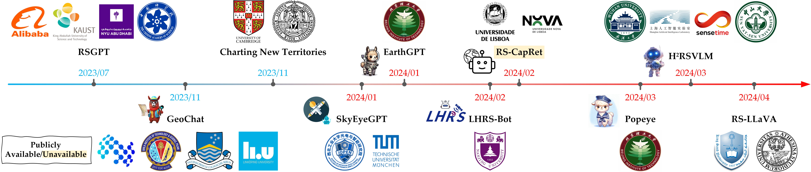
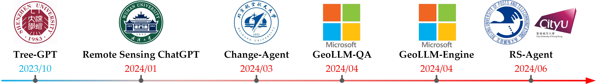
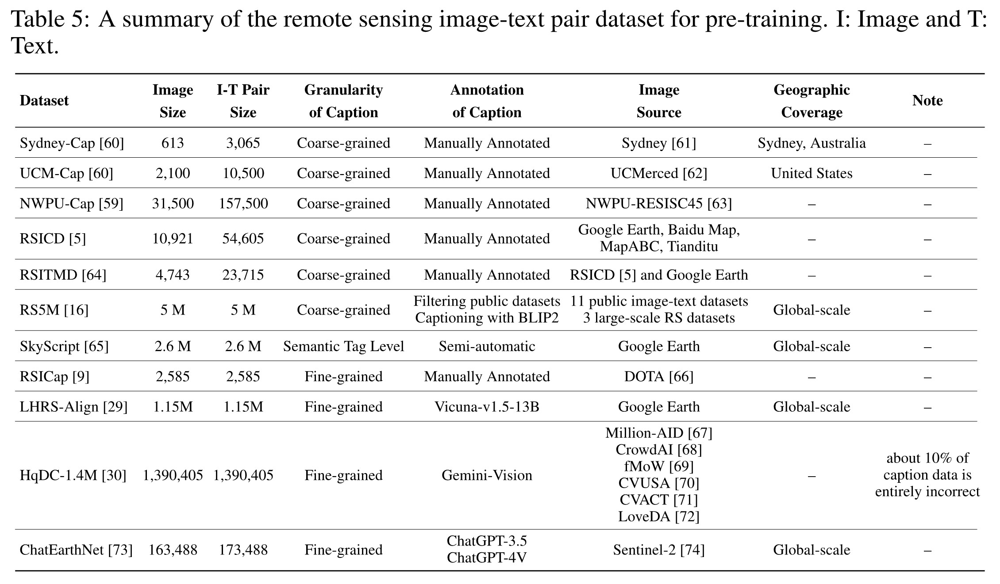
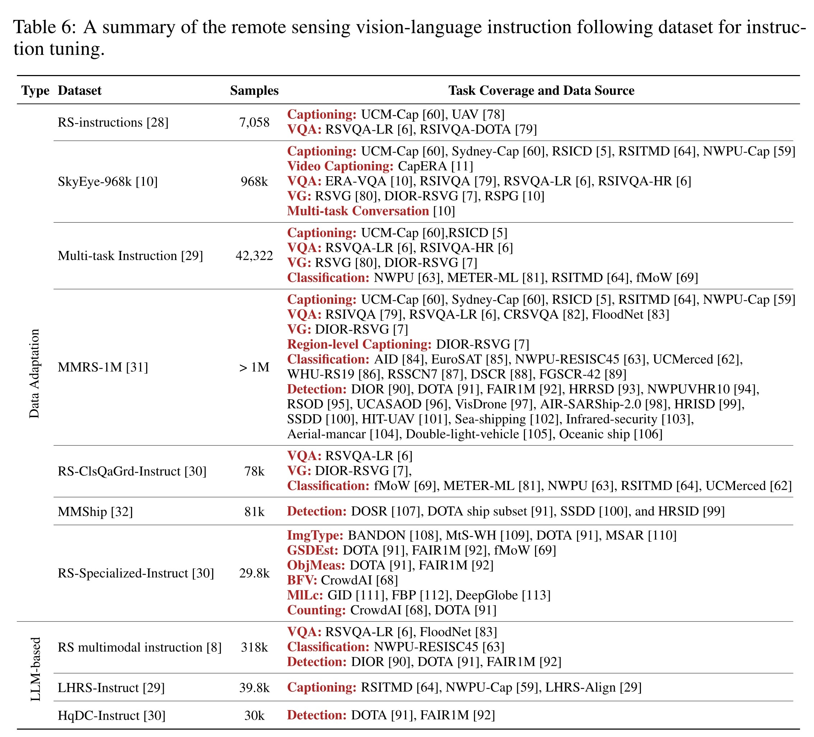
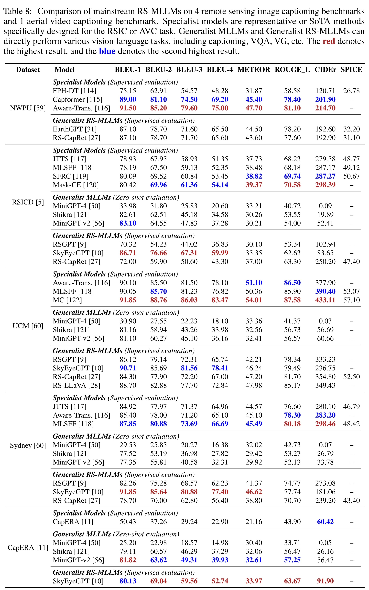
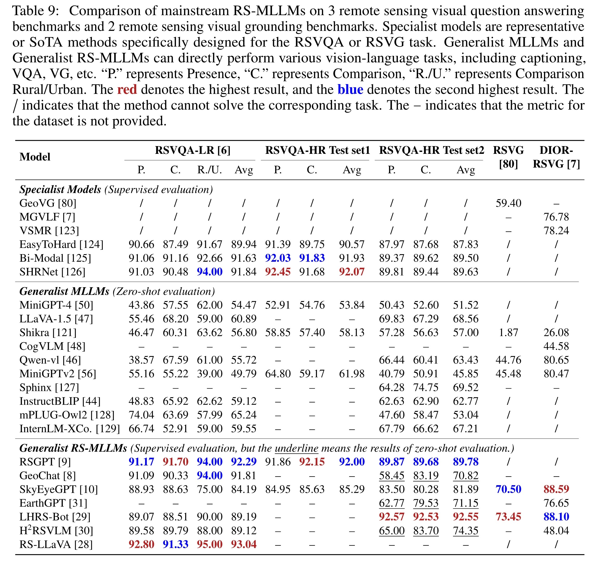
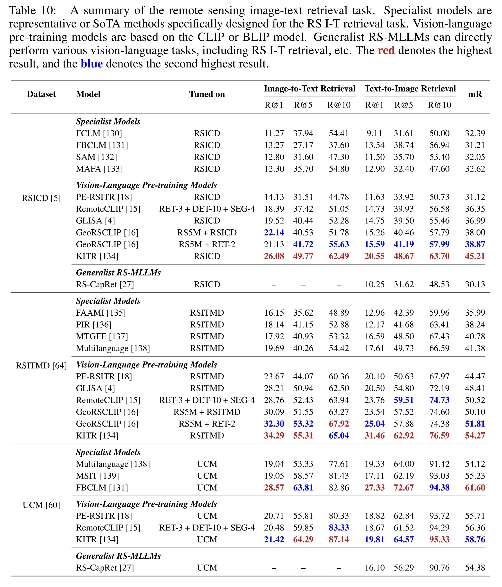
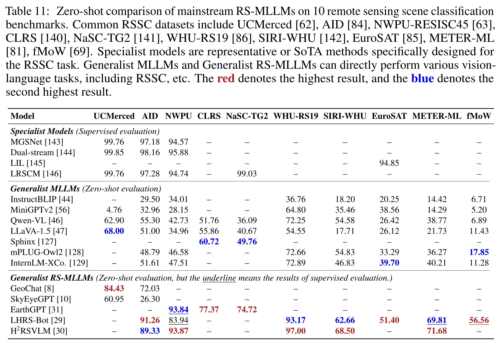

# Awesome-Remote-Sensing-Multimodal-Large-Language-Models

🔥🔥🔥 **Multimodal Large Language Models for Remote Sensing: A Survey**  
**[Project Page][This Page](https://github.com/ZhanYang-nwpu/RS-MLLMs)** | 

**School of Artificial Intelligence, OPtics, and ElectroNics (iOPEN), Northwestern Polytechnical University**

 :sparkles: The <b>first survey</b> for Multimodal Large Language Models for Remote Sensing (RS-MLLMs). 
  

✨✨✨ Behold our meticulously curated trove of RS-MLLMs resources!!!

🎉🚀💡 The website will be updated in real-time to track the latest state of RS-MLLMs!!!

📑📚🔍 Feast your eyes on an assortment of model architecture, training pipelines, datasets, comprehensive evaluation benchmarks, intelligent agents for remote sensing, techniques for instruction tuning, and much more. 

🌟🔥📢 A collection of remote sensing multimodal large language model papers focusing on the vision-language domain.

    

 :apple: Multimodal Large Language Models for Remote Sensing 
  

    

 :apple: Intelligent Agents for Remote Sensing 
  

## Please share a STAR ⭐ if this project does help

## 📢 Latest Updates
In this repository, we will collect and document researchers and their outstanding work related to remote sensing multimodal large language model (vision-language).
- **The list will be continuously updated** 🔥🔥
- 📦 coming soon! 🚀
- **May-22-2024**: The manuscript has been submitted for review. 🔥🔥
  

---

<b> Table of Contents </b> 

- [Awesome Papers](#awesome-papers)
  - [Multimodal Large Language Models for Remote Sensing](#multimodal-large-language-models-for-remote-sensing)
  - [Intelligent Agents for Remote Sensing](#intelligent-agents-for-remote-sensing)
  - [Vision-Language Pre-training Models for Remote Sensing](#vision-language-pre-training-models-for-remote-sensing)
  - [Survey Papers for Remote Sensing Vision-Language Tasks](#survey-papers-for-remote-sensing-vision-language-tasks)
  - [Others](#others)
- [Awesome Datasets](#awesome-datasets)
  - [Datasets of Pre-Training for Alignment](#datasets-of-pre-training-for-alignment)
  - [Datasets of Multimodal Instruction Tuning](#datasets-of-multimodal-instruction-tuning)
- [Latest Evaluation Benchmarks for Remote Sensing Vision-Language Tasks](#latest-evaluation-benchmarks-for-remote-sensing-vision-language-tasks)
  - [Remote Sensing Image Captioning and Aerial Video Captioning](#remote-sensing-image-captioning-and-aerial-video-captioning)
  - [Remote Sensing Visual Question Answering and Remote Sensing Visual Grounding](#remote-sensing-visual-question-answering-and-remote-sensing-visual-grounding)
  - [Remote Sensing Image-Text Retrieval](#remote-sensing-image-text-retrieval)
  - [Remote Sensing Scene Classification](#remote-sensing-scene-classification)
---

# Awesome Papers

## Multimodal Large Language Models for Remote Sensing
|  Title  |   Venue  |   Date   |   Code   |   Note   |
|:--------|:--------:|:--------:|:--------:|:--------:|
|    [**RS-LLaVA: A Large Vision-Language Model for Joint Captioning and Question Answering in Remote Sensing Imagery**](https://www.mdpi.com/2072-4292/16/9/1477)  Y. Bazi, L. Bashmal, M. M. Al Rahhal, R. Ricci, and F. Melgani.  | Remote Sensing | 2024-04-23 | [Github](https://github.com/BigData-KSU/RS-LLaVA) | - |
|    [**H2RSVLM: Towards Helpful and Honest Remote Sensing Large Vision Language Model**](https://arxiv.org/abs/2403.20213.pdf)   C. Pang, W. Jiang, L. Jiayu, L. Yi, S. Jiaxing, L. Weijia, W. Xingxing, W. Shuai, F. Litong, X. Guisong, H.Conghui.  | arXiv | 2024-03-29 | [Github](https://github.com/opendatalab/H2RSVLM) | - |
| [**Popeye: A Unified Visual-Language Model for Multi-Source Ship Detection from Remote Sensing Imagery**](https://arxiv.org/abs/2403.03790.pdf)  W. Zhang, M. Cai, T. Zhang, G. Lei, Y. Zhuang, and X. Mao. | arXiv | 2024-03-06 | - | - |
| [**Large Language Models for Captioning and Retrieving Remote Sensing Images**](https://arxiv.org/abs/2402.06475.pdf)  J. D. Silva, J. Magalhaes, and D. Tuia. | arXiv | 2024-02-09 | - | - |
|    [**LHRS-Bot: Empowering Remote Sensing with VGI-Enhanced Large Multimodal Language Model**](https://arxiv.org/abs/2402.02544v2.pdf)  D. Muhtar, Z. Li, F. Gu, X. Zhang, and P. Xiao.  | arXiv | 2024-02-04 | [Github](https://github.com/NJU-LHRS/LHRS-Bot) | - |
|    [**EarthGPT: A Universal Multi-modal Large Language Model for Multi-sensor Image Comprehension in Remote Sensing Domain**](https://arxiv.org/abs/2401.16822.pdf)  W. Zhang, M. Cai, T. Zhang, Y. Zhuang, and X. Mao.  | arXiv | 2024-01-30 | [Github](https://github.com/wivizhang/EarthGPT) | - |
|    [**SkyEyeGPT: Unifying Remote Sensing Vision-Language Tasks via Instruction Tuning with Large Language Model**](https://arxiv.org/abs/2401.09712.pdf)  Y. Zhan, Z. Xiong, and Y. Yuan.  | arXiv | 2024-01-18 | [Github](https://github.com/ZhanYang-nwpu/SkyEyeGPT) | [Dataset](https://huggingface.co/datasets/ZhanYang-nwpu/SkyEye-968k) |
|    [**GeoChat: Grounded Large Vision-Language Model for Remote Sensing**](http://arxiv.org/abs/2311.15826.pdf)  K. Kuckreja, M. S. Danish, M. Naseer, A. Das, S. Khan, and F. S. Khan.  | arXiv | 2023-11-24 | [Github](https://github.com/mbzuai-oryx/geochat) | accepted by CVPR-24 |
|    [**RSGPT: A Remote Sensing Vision Language Model and Benchmark**](https://arxiv.org/abs/2307.15266.pdf)  Y. Hu, J. Yuan, and C. Wen.  | arXiv | 2023-07-28 | [Github](https://github.com/Lavender105/RSGPT) | - |

## Intelligent Agents for Remote Sensing
|  Title  |   Venue  |   Date   |   Code   |   Note   |
|:--------|:--------:|:--------:|:--------:|:--------:|
| [**GeoLLM-Engine: A Realistic Environment for Building Geospatial Copilots**](https://arxiv.org/abs/2404.15500.pdf)  S. Singh, M. Fore, D. Stamoulis, and D. Group. | arXiv | 2024-04-23 | - | - |
| [**Evaluating Tool-Augmented Agents in Remote Sensing Platforms**](https://arxiv.org/abs/2405.00709v1.pdf)  S. Singh, M. Fore, and D. Stamoulis. | arXiv | 2024-04-23 | - | - |
|    [**Change-Agent: Towards Interactive Comprehensive Remote Sensing Change Interpretation and Analysis**](https://arxiv.org/abs/2403.19646.pdf)  C. Liu, K. Chen, H. Zhang, Z. Qi, Z. Zou, and Z. Shi. | arXiv | 2024-04-01 | [Github](https://github.com/Chen-Yang-Liu/Change-Agent) | - |
|    [**Remote Sensing ChatGPT: Solving Remote Sensing Tasks with ChatGPT and Visual Models**](https://arxiv.org/abs/2401.09083v1.pdf)  H. Guo, X. Su, C. Wu, B. Du, L. Zhang, and D. Li. | arXiv | 2024-01-17 | [Github](https://github.com/HaonanGuo/Remote-Sensing-ChatGPT) | - |
| [**Tree-GPT: Modular Large Language Model Expert System for Forest Remote Sensing Image Understanding and Interactive Analysis**](http://arxiv.org/abs/2310.04698.pdf)  S. Du, S. Tang, W. Wang, X. Li, and R. Guo. | arXiv | 2023-10-07 | - | - |

## Vision-Language Pre-training Models for Remote Sensing
|  Title  |   Venue  |   Date   |   Code   |   Note   |
|:--------|:--------:|:--------:|:--------:|:--------:|
|    [**RS5M and GeoRSCLIP: A Large Scale Vision-Language Dataset and A Large Vision-Language Model for Remote Sensing**](https://arxiv.org/abs/2306.11300.pdf)  Z. Zhang, T. Zhao, Y. Guo, and J. Yin. | arXiv | 2024-01-02 | [Github](https://github.com/om-ai-lab/RS5M) | - |
|    [**RemoteCLIP: A Vision Language Foundation Model for Remote Sensing**](https://ieeexplore.ieee.org/abstract/document/10504785)  F. Liu, D. Chen, Z. Guan, X. Zhou, J. Zhu, and J. Zhou. | T-GRS | 2024-04-18 | [Github](https://github.com/ChenDelong1999/RemoteCLIP) | [arXiv](https://arxiv.org/abs/2306.11029.pdf) |
| [**Remote Sensing Vision-Language Foundation Models without Annotations via Ground Remote Alignment**](https://openreview.net/pdf?id=w9tc699w3Z)  U. Mall, C. P. Phoo, M. K. Liu, C. Vondrick, B. Hariharan, and K. Bala. | ICLR | 2024-01-16 | [Project](https://graft.cs.cornell.edu/) | [arXiv](http://arxiv.org/abs/2312.06960.pdf) |
    [**Parameter-Efficient Transfer Learning for Remote Sensing Image–Text Retrieval**](https://ieeexplore.ieee.org/abstract/document/10231134)  Y. Yuan, Y. Zhan, and Z. Xiong. | T-GRS | 2023-08-28 | [Github](https://github.com/ZhanYang-nwpu/PE-RSITR) | [arXiv](https://arxiv.org/abs/2308.12509.pdf) |

## Survey Papers for Remote Sensing Vision-Language Tasks
|  Title  |   Venue  |   Date   |   Code   |   Note   |
|:--------|:--------:|:--------:|:--------:|:--------:|
| [**Vision-Language Models in Remote Sensing: Current progress and future trends**](https://ieeexplore.ieee.org/document/10506064)  X. Li, C. Wen, Y. Hu, Z. Yuan, and X. X. Zhu. | MGRS | 2024-04-22 | - | - |
| [**Language Integration in Remote Sensing: Tasks, datasets, and future directions**](https://ieeexplore.ieee.org/abstract/document/10278197)  L. Bashmal, Y. Bazi, F. Melgani, M. M. Al Rahhal, and M. A. Al Zuair. | MGRS | 2023-10-11 | - | - |
| [**Brain-Inspired Remote Sensing Foundation Models and Open Problems: A Comprehensive Survey**](https://ieeexplore.ieee.org/abstract/document/10278197)  L. Jiao et al. | JSTARS | 2023-09-18 | - | - |

## Others
|  Title  |   Venue  |   Date   |   Code   |   Note   |
|:--------|:--------:|:--------:|:--------:|:--------:|
| [**On the Foundations of Earth and Climate Foundation Models**](https://arxiv.org/pdf/2405.04285.pdf)  X. X. Zhu et al. | arXiv | 2024-05-07 | [Github](https://github.com/zhu-xlab/EarthFoundationModels) | - |
| [**On the Promises and Challenges of Multimodal Foundation Models for Geographical, Environmental, Agricultural, and Urban Planning Applications**](https://arxiv.org/abs/2312.17016.pdf)  C. Tan et al. | arXiv | 2023-12-23 | - | - |
|    [**Charting New Territories: Exploring the Geographic and Geospatial Capabilities of Multimodal LLMs**](https://arxiv.org/abs/2311.14656.pdf)  J. Roberts, T. Lüddecke, R. Sheikh, K. Han, and S. Albanie.  | arXiv | 2023-11-24 | [Github](https://github.com/jonathan-roberts1/charting-new-territories) | - |
| [**The Potential of Visual ChatGPT for Remote Sensing**](https://www.mdpi.com/2072-4292/15/13/3232)  L. P. Osco, E. L. de Lemos, W. N. Gonçalves, A. P. M. Ramos, and J. Marcato Junior. | Remote Sensing | 2023-06-22 | - | - |

# Awesome Datasets

## Datasets of Pre-Training for Alignment
|  Title  |   Venue  |   Date   |   Code   |   Note   |
|:--------|:--------:|:--------:|:--------:|:--------:|
| [**ChatEarthNet: A Global-Scale, High-Quality Image-Text Dataset for Remote Sensing**](https://arxiv.org/abs/2402.11325.pdf)  Z. Yuan, Z. Xiong, L. Mou, and X. X. Zhu. | arXiv | 2024-02-17 | - | - |
|    [**RS5M and GeoRSCLIP: A Large Scale Vision-Language Dataset and A Large Vision-Language Model for Remote Sensing**](https://arxiv.org/abs/2306.11300.pdf)  Z. Zhang, T. Zhao, Y. Guo, and J. Yin. | arXiv | 2024-01-02 | [Github](https://github.com/om-ai-lab/RS5M) | - |
|    [**SkyScript: A Large and Semantically Diverse Vision-Language Dataset for Remote Sensing**](https://doi.org/10.1609/aaai.v38i6.28393)  Z. Wang, R. Prabha, T. Huang, J. Wu, and R. Rajagopal. | AAAI | 2024-03-24 | [Github](https://github.com/wangzhecheng/SkyScript) | [arXiv](http://arxiv.org/abs/2312.12856.pdf) |

    

## Datasets of Multimodal Instruction Tuning
| Name | Paper | Link | Note |
|:-----|:-----:|:----:|:-----:|
| **RS-instructions** | [RS-LLaVA: A Large Vision-Language Model for Joint Captioning and Question Answering in Remote Sensing Imagery](https://www.mdpi.com/2072-4292/16/9/1477) | [Link](https://github.com/BigData-KSU/RS-LLaVA) | 7,058 | 
| **SkyEye-968k** | [SkyEyeGPT: Unifying Remote Sensing Vision-Language Tasks via Instruction Tuning with Large Language Model](https://arxiv.org/abs/2401.09712.pdf) | [Link](https://huggingface.co/datasets/ZhanYang-nwpu/SkyEye-968k) | 968k | 
| **Multi-task Instruction** | [LHRS-Bot: Empowering Remote Sensing with VGI-Enhanced Large Multimodal Language Model](https://arxiv.org/abs/2402.02544v2.pdf) | [Link](https://github.com/NJU-LHRS/LHRS-Bot) | 42,322 |
| **MMRS-1M** | [EarthGPT: A Universal Multi-modal Large Language Model for Multi-sensor Image Comprehension in Remote Sensing Domain](https://arxiv.org/abs/2401.16822.pdf) | [Link](https://github.com/wivizhang/EarthGPT) | >1M |
| **RS-ClsQaGrd-Instruct** | [H2RSVLM: Towards Helpful and Honest Remote Sensing Large Vision Language Model](https://arxiv.org/abs/2403.20213.pdf) | [Link](https://github.com/opendatalab/H2RSVLM) | 78k |
| **MMShip** | [Popeye: A Unified Visual-Language Model for Multi-Source Ship Detection from Remote Sensing Imagery](https://arxiv.org/abs/2403.03790.pdf) | [Link]() | 81k |
| **RS-Specialized-Instruct** |[H2RSVLM: Towards Helpful and Honest Remote Sensing Large Vision Language Model](https://arxiv.org/abs/2403.20213.pdf) | [Link](https://github.com/opendatalab/H2RSVLM) | 29.8k |
| **RS multimodal instruction** | [GeoChat: Grounded Large Vision-Language Model for Remote Sensing](http://arxiv.org/abs/2311.15826.pdf) | [Link](https://github.com/mbzuai-oryx/geochat) | 318k |
| **LHRS-Instruct** | [LHRS-Bot: Empowering Remote Sensing with VGI-Enhanced Large Multimodal Language Model](https://arxiv.org/abs/2402.02544v2.pdf) | [Link](https://github.com/NJU-LHRS/LHRS-Bot) | 39.8k |
| **HqDC-Instruct** | [H2RSVLM: Towards Helpful and Honest Remote Sensing Large Vision Language Model](https://arxiv.org/abs/2403.20213.pdf) | [Link](https://github.com/opendatalab/H2RSVLM) | 30k |

    

# Latest Evaluation Benchmarks for Remote Sensing Vision-Language Tasks

## Remote Sensing Image Captioning and Aerial Video Captioning

    

## Remote Sensing Visual Question Answering and Remote Sensing Visual Grounding

    

## Remote Sensing Image-Text Retrieval

    

## Remote Sensing Scene Classification

    

## 🤖 Contact
If you have any questions about this project, please feel free to contact zhanyangnwpu@gmail.com.

