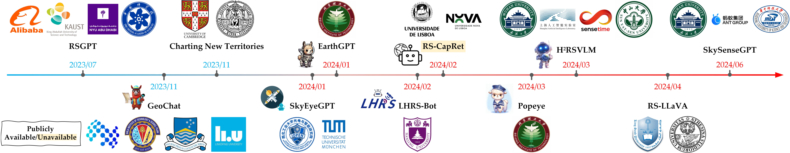

# Awesome-Remote-Sensing-Multimodal-Large-Language-Models

🔥🔥🔥 **Multimodal Large Language Models for Remote Sensing: A Survey**  
**[Project Page][This Page](https://github.com/ZhanYang-nwpu/RS-MLLMs)** | 

**School of Artificial Intelligence, OPtics, and ElectroNics (iOPEN), Northwestern Polytechnical University**

 :sparkles: The <b>first survey</b> for Multimodal Large Language Models for Remote Sensing (RS-MLLMs). 
  

✨✨✨ Behold our meticulously curated trove of RS-MLLMs resources!!!

🎉🚀💡 The website will be updated in real-time to track the latest state of RS-MLLMs!!!

📑📚🔍 Feast your eyes on an assortment of model architecture, training pipelines, datasets, comprehensive evaluation benchmarks, intelligent agents for remote sensing, techniques for instruction tuning, and much more. 

🌟🔥📢 A collection of remote sensing multimodal large language model papers focusing on the vision-language domain.

    

 :apple: Multimodal Large Language Models for Remote Sensing 
  

    

 :apple: Intelligent Agents for Remote Sensing 
  

## Please share a STAR ⭐ if this project does help

## 📢 Latest Updates
In this repository, we will collect and document researchers and their outstanding work related to remote sensing multimodal large language model (vision-language).
- **The list will be continuously updated** 🔥🔥
- 📦 coming soon! 🚀
- **May-22-2024**: The **first RS-MLLMs review** manuscript has been submitted for review. 🔥🔥
  

---

<b> Table of Contents </b> 

- [Awesome Papers](#awesome-papers)
  - [Multimodal Large Language Models for Remote Sensing](#multimodal-large-language-models-for-remote-sensing)
  - [Intelligent Agents for Remote Sensing](#intelligent-agents-for-remote-sensing)
  - [Vision-Language Pre-training Models for Remote Sensing](#vision-language-pre-training-models-for-remote-sensing)
  - [Survey Papers for Remote Sensing Vision-Language Tasks](#survey-papers-for-remote-sensing-vision-language-tasks)
  - [Others](#others)
- [Awesome Datasets](#awesome-datasets)
  - [Datasets of Pre-Training for Alignment](#datasets-of-pre-training-for-alignment)
  - [Datasets of Multimodal Instruction Tuning](#datasets-of-multimodal-instruction-tuning)
- [Latest Evaluation Benchmarks for Remote Sensing Vision-Language Tasks](#latest-evaluation-benchmarks-for-remote-sensing-vision-language-tasks)
  - [Remote Sensing Image Captioning and Aerial Video Captioning](#remote-sensing-image-captioning-and-aerial-video-captioning)
  - [Remote Sensing Visual Question Answering and Remote Sensing Visual Grounding](#remote-sensing-visual-question-answering-and-remote-sensing-visual-grounding)
  - [Remote Sensing Image-Text Retrieval](#remote-sensing-image-text-retrieval)
  - [Remote Sensing Scene Classification](#remote-sensing-scene-classification)
---

# Awesome Papers

## Multimodal Large Language Models for Remote Sensing
|  Title  |   Venue  |   Date   |   Code   |   Note   |
|:--------|:--------:|:--------:|:--------:|:--------:|
|  [**A semantic-enhanced multi-modal remote sensing foundation model for Earth observation**](https://www.nature.com/articles/s42256-025-01078-8)  Wu, K., Zhang, Y., Ru, L., Dang, B., Lao, J., Yu, L., ... & Li, Y.  | Nature Machine Intelligence | 2025-08-04 | - | - |
|  [**Remote Sensing Large Vision-Language Model: Semantic-augmented Multi-level Alignment and Semantic-aware Expert Modeling**](https://arxiv.org/pdf/2506.21863)  Sungjune Park, Yeongyun Kim, Se Yeon Kim, Yong Man Ro  | arXiv | 2025-06-27 | - | - |
|     [**EarthMind: Towards Multi-Granular and Multi-Sensor Earth Observation with Large Multimodal Models**](https://arxiv.org/abs/2506.01667)  Yan Shu, Bin Ren, Zhitong Xiong, Danda Pani Paudel, Luc Van Gool, Begum Demir, Nicu Sebe, Paolo Rota  | arXiv | 2025-06-02 | [Github](https://github.com/shuyansy/EarthMind) | - |
|     [**GeoLLaVA-8K: Scaling Remote-Sensing Multimodal Large Language Models to 8K Resolution**](https://arxiv.org/abs/2505.21375)  Fengxiang Wang, Mingshuo Chen, Yueying Li, Di Wang, Haotian Wang, Zonghao Guo, Zefan Wang, Boqi Shan, Long Lan, Yulin Wang, Hongzhen Wang, Wenjing Yang, Bo Du, Jing Zhang  | arXiv | 2025-05-27 | [Github](https://github.com/MiliLab/GeoLLaVA-8K) | - |
|  [**TinyRS-R1: Compact Multimodal Language Model for Remote Sensing**](https://arxiv.org/abs/2505.12099)  Aybora Koksal, A. Aydin Alatan  | arXiv | 2025-05-17 | - | - |
|  [**EarthGPT-X: Enabling MLLMs to Flexibly and Comprehensively Understand Multi-Source Remote Sensing Imagery**](https://arxiv.org/abs/2504.12795)  Wei Zhang, Miaoxin Cai, Yaqian Ning, Tong Zhang, Yin Zhuang, He Chen, Jun Li, Xuerui Mao  | arXiv | 2025-04-17 | - | - |
|    [**SegEarth-R1: Geospatial Pixel Reasoning via Large Language Model**](https://arxiv.org/abs/2504.09644)  Kaiyu Li, Zepeng Xin, Li Pang, Chao Pang, Yupeng Deng, Jing Yao, Guisong Xia, Deyu Meng, Zhi Wang, Xiangyong Cao  | arXiv | 2025-04-13 | [Github](https://github.com/earth-insights/SegEarth-R1)  | - |
|    [**EarthDial: Turning Multi-sensory Earth Observations to Interactive Dialogues**](https://openaccess.thecvf.com/content/CVPR2025/html/Soni_EarthDial_Turning_Multi-sensory_Earth_Observations_to_Interactive_Dialogues_CVPR_2025_paper.html)  Sagar Soni, Akshay Dudhane, Hiyam Debary, Mustansar Fiaz, Muhammad Akhtar Munir, Muhammad Sohail Danish, Paolo Fraccaro, Campbell D Watson, Levente J Klein, Fahad Shahbaz Khan, Salman Khan  | CVPR-25 | 2025-04-07 | [Github](https://github.com/hiyamdebary/EarthDial)  | - |
|    [**EagleVision: Object-level Attribute Multimodal LLM for Remote Sensing**](https://arxiv.org/abs/2503.23330)  H. Jiang, J. Yin, Q. Wang, J. Feng, G. Chen  | arXiv | 2025-03-30 | [Github](https://github.com/XiangTodayEatsWhat/EagleVision)  | - |
|  [**OmniGeo: Towards a Multimodal Large Language Models for Geospatial Artificial Intelligence**](https://arxiv.org/abs/2503.16326)  Yuan, L., Mo, F., Huang, K., Wang, W., Zhai, W., Zhu, X., ... & Nie, J. Y.  | arXiv | 2025-03-20 | - | - |
|    [**Falcon: A Remote Sensing Vision-Language Foundation Model**](https://arxiv.org/abs/2503.11070)  K. Yao, N. Xu, R. Yang, Y. Xu, Z. Gao, T. Kitrungrotsakul, Y. Ren, P. Zhang, J. Wang, N. Wei, C. Li  | arXiv | 2025-03-14 | [Github](https://github.com/TianHuiLab/Falcon)  | - |
|    [**When Large Vision-Language Model Meets Large Remote Sensing Imagery: Coarse-to-Fine Text-Guided Token Pruning**](https://arxiv.org/abs/2503.07588)  J. Luo, Y. Zhang, X. Yang, K. Wu, Q. Zhu, L. Liang, J. Chen, Y. Li | arXiv | 2025-03-10 | [Github](https://github.com/VisionXLab/LRS-VQA)  | - |
|    [**Co-LLaVA: Efficient Remote Sensing Visual Question Answering via Model Collaboration**](https://www.mdpi.com/2072-4292/17/3/466) <be>Liu, F., Dai, W., Zhang, C., Zhu, J., Yao, L., & Li, X.  | arXiv | 2025-01-29 | [Github](https://github.com/demo1shining/Co-LLaVA)  | - |
|    [**GeoPixel: Pixel Grounding Large Multimodal Model in Remote Sensing**](https://arxiv.org/abs/2501.13925) <be>A. Shabbir, M. Zumri, M. Bennamoun, F. S. Khan, S. Khan  | arXiv | 2025-01-23 | [Github](https://github.com/mbzuai-oryx/GeoPixel)  | - |
|    [**GeoPix: Multi-Modal Large Language Model for Pixel-level Image Understanding in Remote Sensing**](https://arxiv.org/abs/2501.06828) <be>R. Ou, Y. Hu, F. Zhang, J. Chen, Y. Liu  | arXiv | 2025-01-12 | [Github](https://github.com/Norman-Ou/GeoPix)  | accepted by GRSM-25 |
|    [**RSUniVLM: A Unified Vision Language Model for Remote Sensing via Granularity-oriented Mixture of Experts**](https://arxiv.org/abs/2412.05679) <be>Xu Liu, Zhouhui Lian  | arXiv | 2024-12-10 | [Github](https://github.com/xuliu-cyber/RSUniVLM)  | - |
|  [**RingMoGPT: A Unified Remote Sensing Foundation Model for Vision, Language, and grounded tasks**](https://ieeexplore.ieee.org/abstract/document/10777289)  P. Wang, H. Hu, B. Tong, Z. Zhang, F. Yao, Y. Feng, Z. Zhu, H. Chang, W. Diao, Q. Ye, and X. Sun  | T-GRS | 2024-12-04 | - | - |
|    [**GeoGround: A Unified Large Vision-Language Model for Remote Sensing Visual Grounding**](https://arxiv.org/abs/2411.11904)  Y. Zhou, M. Lan, X. Li, Y. Ke, X. Jiang, L. Feng, and W. Zhang  | arXiv | 2024-11-16 | [Github](https://github.com/zytx121/GeoGround) | - |
|  [**Large Vision-Language Models for Remote Sensing Visual Question Answering**](https://arxiv.org/abs/2411.10857)  S. Siripong, A. Chaiyapan, and T. Phonchai  | arXiv | 2024-11-16 | - | - |
|    [**LHRS-Bot-Nova: Improved Multimodal Large Language Model for Remote Sensing Vision-Language Interpretation**](https://arxiv.org/abs/2411.09301)  Z. Li, D. Muhtar, F. Gu, X. Zhang, P. Xiao, G. He, and X. Zhu  | arXiv | 2024-11-14 | [Github](https://github.com/NJU-LHRS/LHRS-Bot/tree/nova) | accepted by ISPRS-25 |
|  [**RS-MoE: Mixture of Experts for Remote Sensing Image Captioning and Visual Question Answering**](https://arxiv.org/abs/2411.01595)  Lin, H., Hong, D., Ge, S., Luo, C., Jiang, K., Jin, H., and Wen, C | arXiv | 2024-11-03 | - | accepted by TGRS-25 |
|    [**GeoLLaVA: Efficient Fine-Tuned Vision-Language Models for Temporal Change Detection in Remote Sensing**](https://arxiv.org/pdf/2410.19552)  Elgendy, H., Sharshar, A., Aboeitta, A., Ashraf, Y., and Guizani, M.  | arXiv | 2024-10-25 | [Github](https://github.com/HosamGen/GeoLLaVA) | - |
|    [**TEOChat: Large Language and Vision Assistant for Temporal Earth Observation Data**](https://arxiv.org/pdf/2410.06234)  J. Irvin, Jeremy Andrew, et al.  | arXiv | 2024-10-08 | [Github](https://github.com/ermongroup/TEOChat) | - |
|  [**CDChat: A Large Multimodal Model for Remote Sensing Change Description**](https://arxiv.org/abs/2409.16261)  Noman, M., Ahsan, N., Naseer, M., Cholakkal, H., Anwer, R. M., Khan, S., & Khan, F. S C | arXiv | 2024-09-24 | - | - |
|    [**EarthMarker: A Visual Prompting MLLM for Region-level and Point-level Remote Sensing Imagery Comprehension**](https://arxiv.org/pdf/2407.13596)  Zhang, W., Cai, M., Zhang, T., Zhuang, Y., and Mao, X.  | arXiv | 2024-07-18 | [Github](https://github.com/wivizhang/EarthMarker) | accepted by TGRS-24 |
|    [**SkySenseGPT: A Fine-Grained Instruction Tuning Dataset and Model for Remote Sensing Vision-Language Understanding**](http://arxiv.org/abs/2406.10100)  J. Luo et al.  | arXiv | 2024-06-14 | [Github](https://github.com/Luo-Z13/SkySenseGPT) | - |
|    [**RS-LLaVA: A Large Vision-Language Model for Joint Captioning and Question Answering in Remote Sensing Imagery**](https://www.mdpi.com/2072-4292/16/9/1477)  Y. Bazi, L. Bashmal, M. M. Al Rahhal, R. Ricci, and F. Melgani.  | Remote Sensing | 2024-04-23 | [Github](https://github.com/BigData-KSU/RS-LLaVA) | - |
|    [**VHM: Versatile and Honest Vision Language Model for Remote Sensing Image Analysis**](https://ojs.aaai.org/index.php/AAAI/article/view/32683) [H2RSVLM: Towards Helpful and Honest Remote Sensing Large Vision Language Model]   C. Pang, W. Jiang, L. Jiayu, L. Yi, S. Jiaxing, L. Weijia, W. Xingxing, W. Shuai, F. Litong, X. Guisong, H.Conghui.  | arXiv | 2024-03-29 | [Github](https://github.com/opendatalab/VHM)  | accepted by AAAI-25 |
| [**Popeye: A Unified Visual-Language Model for Multi-Source Ship Detection from Remote Sensing Imagery**](https://arxiv.org/abs/2403.03790.pdf)  W. Zhang, M. Cai, T. Zhang, G. Lei, Y. Zhuang, and X. Mao. | arXiv | 2024-03-06 | - | accepted by JSTARS-24 |
| [**Large Language Models for Captioning and Retrieving Remote Sensing Images**](https://arxiv.org/abs/2402.06475.pdf)  J. D. Silva, J. Magalhaes, and D. Tuia. | arXiv | 2024-02-09 | - | - |
|    [**LHRS-Bot: Empowering Remote Sensing with VGI-Enhanced Large Multimodal Language Model**](https://arxiv.org/abs/2402.02544v2.pdf)  D. Muhtar, Z. Li, F. Gu, X. Zhang, and P. Xiao.  | arXiv | 2024-02-04 | [Github](https://github.com/NJU-LHRS/LHRS-Bot) | accepted by ECCV-24 |
|    [**EarthGPT: A Universal Multi-modal Large Language Model for Multi-sensor Image Comprehension in Remote Sensing Domain**](https://arxiv.org/abs/2401.16822.pdf)  W. Zhang, M. Cai, T. Zhang, Y. Zhuang, and X. Mao.  | arXiv | 2024-01-30 | [Github](https://github.com/wivizhang/EarthGPT) | accepted by IEEE-TGRS|
|    [**SkyEyeGPT: Unifying Remote Sensing Vision-Language Tasks via Instruction Tuning with Large Language Model**](https://arxiv.org/abs/2401.09712.pdf)  Y. Zhan, Z. Xiong, and Y. Yuan.  | arXiv | 2024-01-18 | [Github](https://github.com/ZhanYang-nwpu/SkyEyeGPT) | accepted by ISPRS-25 |
|    [**GeoChat: Grounded Large Vision-Language Model for Remote Sensing**](http://arxiv.org/abs/2311.15826.pdf)  K. Kuckreja, M. S. Danish, M. Naseer, A. Das, S. Khan, and F. S. Khan.  | arXiv | 2023-11-24 | [Github](https://github.com/mbzuai-oryx/geochat) | accepted by CVPR-24 |
|    [**RSGPT: A Remote Sensing Vision Language Model and Benchmark**](https://arxiv.org/abs/2307.15266.pdf)  Y. Hu, J. Yuan, and C. Wen.  | arXiv | 2023-07-28 | [Github](https://github.com/Lavender105/RSGPT) | accepted by ISPRS-25 |

## Intelligent Agents for Remote Sensing
|  Title  |   Venue  |   Date   |   Code   |   Note   |
|:--------|:--------:|:--------:|:--------:|:--------:|
| [**RS-Agent: Automating Remote Sensing Tasks through Intelligent Agents**](https://arxiv.org/abs/2406.07089)  W. Xu, Z. Yu, Y. Wang, J. Wang, and M. Peng. | arXiv | 2024-06-11 | - | - |
| [**GeoLLM-Engine: A Realistic Environment for Building Geospatial Copilots**](https://arxiv.org/abs/2404.15500.pdf)  S. Singh, M. Fore, D. Stamoulis, and D. Group. | arXiv | 2024-04-23 | - | - |
| [**Evaluating Tool-Augmented Agents in Remote Sensing Platforms**](https://arxiv.org/abs/2405.00709v1.pdf)  S. Singh, M. Fore, and D. Stamoulis. | arXiv | 2024-04-23 | - | - |
|    [**Change-Agent: Towards Interactive Comprehensive Remote Sensing Change Interpretation and Analysis**](https://arxiv.org/abs/2403.19646.pdf)  C. Liu, K. Chen, H. Zhang, Z. Qi, Z. Zou, and Z. Shi. | arXiv | 2024-04-01 | [Github](https://github.com/Chen-Yang-Liu/Change-Agent) | - |
|    [**Remote Sensing ChatGPT: Solving Remote Sensing Tasks with ChatGPT and Visual Models**](https://arxiv.org/abs/2401.09083v1.pdf)  H. Guo, X. Su, C. Wu, B. Du, L. Zhang, and D. Li. | arXiv | 2024-01-17 | [Github](https://github.com/HaonanGuo/Remote-Sensing-ChatGPT) | - |
| [**Tree-GPT: Modular Large Language Model Expert System for Forest Remote Sensing Image Understanding and Interactive Analysis**](http://arxiv.org/abs/2310.04698.pdf)  S. Du, S. Tang, W. Wang, X. Li, and R. Guo. | arXiv | 2023-10-07 | - | - |

## Vision-Language Pre-training Models for Remote Sensing
|  Title  |   Venue  |   Date   |   Code   |   Note   |
|:--------|:--------:|:--------:|:--------:|:--------:|
|    [**LRSCLIP: A Vision-Language Foundation Model for Aligning Remote Sensing Image with Longer Text**](https://arxiv.org/abs/2503.19311)  W. Chen, J. Chen, Y. Deng, J. Chen, Y. Feng, Z. Xi, D. Liu, K. Li, Y. Meng. | arXiv | 2025-03-25 | [Github](https://github.com/MitsuiChen14/LRSCLIP) | [arXiv](https://arxiv.org/abs/2503.19311.pdf) |
|    [**DOFA-CLIP: Multimodal Vision-Language Foundation Models for Earth Observation**](https://arxiv.org/abs/2503.06312)  Zhitong Xiong, Yi Wang, Weikang Yu, Adam J Stewart, Jie Zhao, Nils Lehmann, Thomas Dujardin, Zhenghang Yuan, Pedram Ghamisi, Xiao Xiang Zhu. | arXiv | 2025-03-08 | [Github](https://github.com/xiong-zhitong/DOFA-CLIP) | - 
|    [**RS5M and GeoRSCLIP: A Large Scale Vision-Language Dataset and A Large Vision-Language Model for Remote Sensing**](https://arxiv.org/abs/2306.11300.pdf)  Z. Zhang, T. Zhao, Y. Guo, and J. Yin. | arXiv | 2024-01-02 | [Github](https://github.com/om-ai-lab/RS5M) | accepted by IEEE-TGRS |
|    [**RemoteCLIP: A Vision Language Foundation Model for Remote Sensing**](https://ieeexplore.ieee.org/abstract/document/10504785)  F. Liu, D. Chen, Z. Guan, X. Zhou, J. Zhu, and J. Zhou. | T-GRS | 2024-04-18 | [Github](https://github.com/ChenDelong1999/RemoteCLIP) | [arXiv](https://arxiv.org/abs/2306.11029.pdf) |
| [**Remote Sensing Vision-Language Foundation Models without Annotations via Ground Remote Alignment**](https://openreview.net/pdf?id=w9tc699w3Z)  U. Mall, C. P. Phoo, M. K. Liu, C. Vondrick, B. Hariharan, and K. Bala. | ICLR | 2024-01-16 | [Project](https://graft.cs.cornell.edu/) | [arXiv](http://arxiv.org/abs/2312.06960.pdf) |
    [**RS-CLIP: Zero Shot Remote Sensing Scene Classification via Contrastive Vision-Language Supervision**](https://www.sciencedirect.com/science/article/pii/S1569843223003217)  X. Li, C. Wen, Y. Hu, and N. Zhou. | JAG | 2023-09-18 | [Github](https://github.com/lx709/RS-CLIP) | - |
    [**Parameter-Efficient Transfer Learning for Remote Sensing Image–Text Retrieval**](https://ieeexplore.ieee.org/abstract/document/10231134)  Y. Yuan, Y. Zhan, and Z. Xiong. | T-GRS | 2023-08-28 | [Github](https://github.com/ZhanYang-nwpu/PE-RSITR) | [arXiv](https://arxiv.org/abs/2308.12509.pdf) |

## Survey Papers for Remote Sensing Vision-Language Tasks
|  Title  |   Venue  |   Date   |   Code   |   Note   |
|:--------|:--------:|:--------:|:--------:|:--------:|
| [**Vision-Language Modeling Meets Remote Sensing: Models, datasets, and perspectives**](https://ieeexplore.ieee.org/abstract/document/11028078/)  Xingxing Weng; Chao Pang; Gui-Song Xia. | GRSM | 2025-06-09 | - | - |
|   [**A Survey on Remote Sensing Foundation Models: From Vision to Multimodality**](https://arxiv.org/abs/2412.02573)  Z. Huang, H. Yan, Q. Zhan, S. Yang, M. Zhang, C. Zhang, Y. Lei, Z. Liu, Q. Liu, Y. Wang  | arXiv | 2025-03-28 | [Github](https://github.com/IRIP-BUAA/A-Survey-on-Data-Synthesis-and-Augmentation-for-Large-Language-Models) | [arXiv](https://arxiv.org/abs/2503.22081) |
| [**GeoRSMLLM: A Multimodal Large Language Model for Vision-Language Tasks in Geoscience and Remote Sensing**](https://arxiv.org/abs/2503.12490)  Z. Zhang, H. Shen, T. Zhao, B. Chen, Z. Guan, Y. Wang, X. Jia, Y. Cai, Y. Shang, J. Yin. | arXiv | 2025-03-16 | - | - |
| [**When Remote Sensing Meets Foundation Model: A Survey and Beyond**](https://www.mdpi.com/2072-4292/17/2/179)  Huo, Chunlei; Chen, Keming; Zhang, Shuaihao; Wang, Zeyu; Yan, Heyu; Shen, Jing; Hong, Yuyang; Qi, Geqi; Fang, Hongmei; Wang, Zihan. | remote sensing | 2025-01-07 | - | - |
|   [**Remote Sensing Temporal Vision-Language Models: A Comprehensive Survey**](https://arxiv.org/abs/2412.02573)  C. Liu, J. Zhang, K. Chen, M. Wang, Z. Zou, and Z. Shi  | arXiv | 2024-12-03 | [Github](https://github.com/Chen-Yang-Liu/Awesome-RS-Temporal-VLM) | [arXiv](https://arxiv.org/abs/2412.02573) |
| [**From Pixels to Prose: Advancing Multi-Modal Language Models for Remote Sensing**](https://arxiv.org/abs/2411.05826)  X. Sun, B. Peng, C. Zhang, F. Jin, Q. Niu, J. Liu, K. Chen, M. Li, P. Feng, Z. Bi, M. Liu, and Y. Zhang. | arXiv | 2024-11-05 | - | - |
|   [**Foundation Models for Remote Sensing and Earth Observation: A Survey**](https://arxiv.org/abs/2410.16602)  A. Xiao, W. Xuan, J. Wang, J. Huang, D. Tao, S. Lu, and N. Yokoya. | arXiv | 2024-10-22 | [Github](https://github.com/xiaoaoran/awesome-RSFMs) | accepted by GRSM-25 |
|   [**Advancements in Visual Language Models for Remote Sensing: Datasets, Capabilities, and Enhancement Techniques**](https://arxiv.org/abs/2410.17283)  L. Tao, H. Zhang, H. Jing, Y. Liu, K. Yao, C. Li, and X. Xue. | arXiv | 2024-10-15 | [Github](https://github.com/taolijie11111/VLMs-in-RS-review) | accepted by remote sensing-25 |
|   [**Towards Vision-Language Geo-Foundation Model: A Survey**](http://arxiv.org/abs/2406.09385)  Y. Zhou, L. Feng, Y. Ke, X. Jiang, J. Yan, and W. Zhang. | arXiv | 2024-06-13 | [Github](https://github.com/zytx121/Awesome-VLGFM) | [arXiv](http://arxiv.org/abs/2406.09385) |
| [**Vision-Language Models in Remote Sensing: Current progress and future trends**](https://ieeexplore.ieee.org/document/10506064)  X. Li, C. Wen, Y. Hu, Z. Yuan, and X. X. Zhu. | MGRS | 2024-04-22 | - | - |
| [**Language Integration in Remote Sensing: Tasks, datasets, and future directions**](https://ieeexplore.ieee.org/abstract/document/10278197)  L. Bashmal, Y. Bazi, F. Melgani, M. M. Al Rahhal, and M. A. Al Zuair. | MGRS | 2023-10-11 | - | - |
| [**Brain-Inspired Remote Sensing Foundation Models and Open Problems: A Comprehensive Survey**](https://ieeexplore.ieee.org/abstract/document/10278197)  L. Jiao et al. | JSTARS | 2023-09-18 | - | - |

## Others
|  Title  |   Venue  |   Date   |   Code   |   Note   |
|:--------|:--------:|:--------:|:--------:|:--------:|
| [**On the Foundations of Earth and Climate Foundation Models**](https://arxiv.org/pdf/2405.04285.pdf)  X. X. Zhu et al. | arXiv | 2024-05-07 | [Github](https://github.com/zhu-xlab/EarthFoundationModels) | - |
| [**On the Promises and Challenges of Multimodal Foundation Models for Geographical, Environmental, Agricultural, and Urban Planning Applications**](https://arxiv.org/abs/2312.17016.pdf)  C. Tan et al. | arXiv | 2023-12-23 | - | - |
|    [**Charting New Territories: Exploring the Geographic and Geospatial Capabilities of Multimodal LLMs**](https://arxiv.org/abs/2311.14656.pdf)  J. Roberts, T. Lüddecke, R. Sheikh, K. Han, and S. Albanie.  | arXiv | 2023-11-24 | [Github](https://github.com/jonathan-roberts1/charting-new-territories) | - |
| [**The Potential of Visual ChatGPT for Remote Sensing**](https://www.mdpi.com/2072-4292/15/13/3232)  L. P. Osco, E. L. de Lemos, W. N. Gonçalves, A. P. M. Ramos, and J. Marcato Junior. | Remote Sensing | 2023-06-22 | - | - |

# Awesome Datasets

## Datasets of Pre-Training for Alignment
|  Title  |   Venue  |   Date   |   Code   |   Note   |
|:--------|:--------:|:--------:|:--------:|:--------:|
|  <be> [**RSTeller: Scaling Up Visual Language Modeling in Remote Sensing with Rich Linguistic Semantics from Openly Available Data and Large Language Models**](https://arxiv.org/pdf/2408.14744.pdf)  J. Ge, Y. Zheng, K. Guo, and J. Liang. | arXiv | 2024-08-27 | [Github](https://github.com/SlytherinGe/RSTeller) | [Link](https://huggingface.co/datasets/SlytherinGe/RSTeller) |
|  <be> [**ChatEarthNet: A Global-Scale, High-Quality Image-Text Dataset for Remote Sensing**](https://arxiv.org/abs/2402.11325.pdf)  Z. Yuan, Z. Xiong, L. Mou, and X. X. Zhu. | arXiv | 2024-02-17 | [Github](https://github.com/zhu-xlab/ChatEarthNet) | [Link](https://zenodo.org/records/11003436) |
|    [**RS5M and GeoRSCLIP: A Large Scale Vision-Language Dataset and A Large Vision-Language Model for Remote Sensing**](https://arxiv.org/abs/2306.11300.pdf)  Z. Zhang, T. Zhao, Y. Guo, and J. Yin. | arXiv | 2024-01-02 | [Github](https://github.com/om-ai-lab/RS5M) | - |
|    [**SkyScript: A Large and Semantically Diverse Vision-Language Dataset for Remote Sensing**](https://doi.org/10.1609/aaai.v38i6.28393)  Z. Wang, R. Prabha, T. Huang, J. Wu, and R. Rajagopal. | AAAI | 2024-03-24 | [Github](https://github.com/wangzhecheng/SkyScript) | [arXiv](http://arxiv.org/abs/2312.12856.pdf) |

    

## Datasets of Multimodal Instruction Tuning
| Name | Paper | Link | Note |
|:-----|:-----:|:----:|:-----:|
| **DDFAV** | [DDFAV: Remote Sensing Large Vision Language Models Dataset and Evaluation Benchmark](https://arxiv.org/pdf/2411.02733) | [Link](https://github.com/HaodongLi2024/rspope) | 27.7k | 
| **VRSBench** | [VRSBench: A Versatile Vision-Language Benchmark Dataset for Remote Sensing Image Understanding](https://arxiv.org/pdf/2406.12384) | [Link](https://vrsbench.github.io/) | 29.6k | 
| **FIT-RS** | [SkySenseGPT: A Fine-Grained Instruction Tuning Dataset and Model for Remote Sensing Vision-Language Understanding](http://arxiv.org/abs/2406.10100) | [Link](https://huggingface.co/datasets/ll-13/FIT-RS) | 1800.8k | 
| **RS-GPT4V** | [RS-GPT4V: A Unified Multimodal Instruction-Following Dataset for Remote Sensing Image Understanding](https://arxiv.org/abs/2406.09385) | [Link](https://github.com/GeoX-Lab/RS-GPT4V) | 991k | 
| **RS-instructions** | [RS-LLaVA: A Large Vision-Language Model for Joint Captioning and Question Answering in Remote Sensing Imagery](https://www.mdpi.com/2072-4292/16/9/1477) | [Link](https://github.com/BigData-KSU/RS-LLaVA) | 7,058 | 
| **SkyEye-968k** | [SkyEyeGPT: Unifying Remote Sensing Vision-Language Tasks via Instruction Tuning with Large Language Model](https://arxiv.org/abs/2401.09712.pdf) | [Link](https://huggingface.co/datasets/ZhanYang-nwpu/SkyEye-968k) | 968k | 
| **Multi-task Instruction** | [LHRS-Bot: Empowering Remote Sensing with VGI-Enhanced Large Multimodal Language Model](https://arxiv.org/abs/2402.02544v2.pdf) | [Link](https://github.com/NJU-LHRS/LHRS-Bot) | 42,322 |
| **MMRS-1M** | [EarthGPT: A Universal Multi-modal Large Language Model for Multi-sensor Image Comprehension in Remote Sensing Domain](https://arxiv.org/abs/2401.16822.pdf) | [Link](https://github.com/wivizhang/EarthGPT) | >1M |
| **RS-ClsQaGrd-Instruct** | [H2RSVLM: Towards Helpful and Honest Remote Sensing Large Vision Language Model](https://arxiv.org/abs/2403.20213.pdf) | [Link](https://github.com/opendatalab/H2RSVLM) | 78k |
| **MMShip** | [Popeye: A Unified Visual-Language Model for Multi-Source Ship Detection from Remote Sensing Imagery](https://arxiv.org/abs/2403.03790.pdf) | [Link]() | 81k |
| **RS-Specialized-Instruct** |[H2RSVLM: Towards Helpful and Honest Remote Sensing Large Vision Language Model](https://arxiv.org/abs/2403.20213.pdf) | [Link](https://github.com/opendatalab/H2RSVLM) | 29.8k |
| **RS multimodal instruction** | [GeoChat: Grounded Large Vision-Language Model for Remote Sensing](http://arxiv.org/abs/2311.15826.pdf) | [Link](https://github.com/mbzuai-oryx/geochat) | 318k |
| **LHRS-Instruct** | [LHRS-Bot: Empowering Remote Sensing with VGI-Enhanced Large Multimodal Language Model](https://arxiv.org/abs/2402.02544v2.pdf) | [Link](https://github.com/NJU-LHRS/LHRS-Bot) | 39.8k |
| **HqDC-Instruct** | [H2RSVLM: Towards Helpful and Honest Remote Sensing Large Vision Language Model](https://arxiv.org/abs/2403.20213.pdf) | [Link](https://github.com/opendatalab/H2RSVLM) | 30k |

    

# Latest Evaluation Benchmarks for Remote Sensing Vision-Language Tasks

## Remote Sensing Image Captioning and Aerial Video Captioning

    

## Remote Sensing Visual Question Answering and Remote Sensing Visual Grounding

    

## Remote Sensing Image-Text Retrieval

    

## Remote Sensing Scene Classification

    

## 🤖 Contact
If you have any questions about this project, please feel free to contact zhanyangnwpu@gmail.com.

